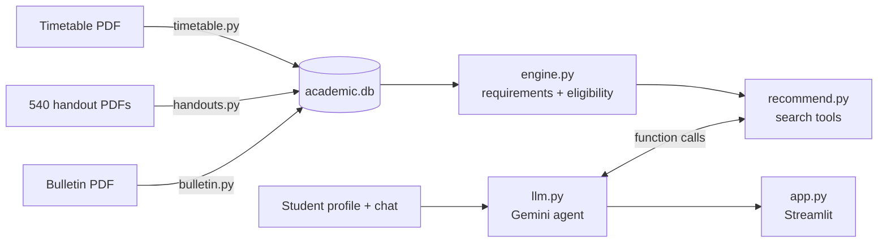

# BITS Academic Course Recommender (Postman Round 2)

A dashboard where a BITS Pilani student saves their academic profile and asks questions like
*"Suggest DELs related to AI"* or *"I want an OPEL with no attendance requirement"*.
The system first works out what the student is **required and eligible** to take, using fixed rules
over data extracted from the supplied documents, and only then matches their preferences.


## PLEASE NOTE
- If the UI says Gemini not working- It always means that its at heavy cloud usage traffic, just try after 3-5 minutes. 
- If my API key quota is over, make your own free API key and paste it in .env
## Run it

```
python -m venv .venv
.venv\Scripts\activate                 (Windows)   |   source .venv/bin/activate   (Mac/Linux)
pip install -r requirements.txt
```
Put the dataset in `data/raw/`: `timetable.pdf`, `bulletin.pdf`, and the handouts in `data/raw/handouts/`.
Copy `.env.example` to `.env` and add a Gemini API key from Google AI Studio. The app shows at the top whether
Gemini is connected; without it, a clearly labelled offline keyword mode answers instead.

```
python timetable.py data/raw/timetable.pdf data/processed/academic.db
python handouts.py  data/raw/handouts      data/processed/academic.db
python bulletin.py  data/raw/bulletin.pdf  data/processed/academic.db
python -m pytest -q
streamlit run app.py
```
Each preprocessing script replaces only its own tables, so they can be re-run independently; a new
semester's timetable or handouts only needs the relevant script re-run.

## Files

| File | Role |
|---|---|
| `timetable.py` | Timetable → `courses`, `sections` (slots, cancelled flag, midsem/compre per section), `equivalents` |
| `handouts.py` | Handouts → `handouts` (midsem, components, makeup, attendance, topics, source quotes) + `handouts_review.csv` |
| `bulletin.py` | Bulletin → `programme_courses` (core / DEL / humanities pool) and `programme_targets` (unit targets) |
| `engine.py` | Deterministic rules: remaining requirements, eligible courses with their category (CDC/DEL/HUEL/OPEL), and why a course is not available |
| `recommend.py` | The agent's tools: `search_courses` (eligible courses + handout facts, filtered by category, code prefix, keywords, midsem/attendance/makeup/project/open-book) and `course_details` |
| `llm.py` | Gemini chat agent with function calling and chat history; offline keyword mode |
| `app.py` | Streamlit dashboard: profile, remaining requirements, chat |

## Student profile

The year of study is worked out from the admission year (2024 → year 3 in Sem I 2026-27) and can be
overridden. CDCs normally taken in earlier years (course numbers F2xx for a third-year, and so on) are assumed
cleared, so the student only marks **backlogs**, the **electives** they have done (the list shows only their
programme's DELs and the humanities pool) and any other courses. First-year courses are never recommended to
students past first year.

## Design decisions

- **Rules decide, the LLM converses.** Eligibility is decided only by `engine.py`. Gemini is an agent with three
  tools (`get_requirements`, `search_courses`, `get_course_details`); it decides which to call, does the semantic
  matching (for "AI-related" it reads the eligible DELs' titles and syllabus topics and picks, e.g., the LLM course),
  and writes the answer. It can only recommend courses the tools returned, and is told to say "not verified" when a
  handout fact is missing.
- **Visible fallback.** Without a working key the app says so at the top and answers with keyword matching.
- **Rule-based extraction, no LLM in preprocessing.** All three documents are parsed with regular expressions
  into SQLite. Anything the rules cannot decide is stored as `unknown`/`NULL` and shown as *not verified*
  rather than guessed.
- **Source kept.** Handout rows keep the original makeup/attendance sentences and file name; Bulletin rows keep
  the page number; timetable rows keep the raw text.
- **Self-checks.** Handout evaluation weights must sum to 100; Bulletin core lists are compared with the
  Bulletin's own "Discipline Core – N Units (M Courses)" lines.

## Rules implemented

| Rule | Source |
|---|---|
| Remaining CDCs = programme core − completed (equivalent courses count as completed) | Bulletin lists; timetable §IX |
| DEL units remaining against the programme's target | Bulletin semester charts |
| 8 units of humanities electives; own-discipline courses can't count as HUEL | Bulletin IV-1, IV-127 |
| Extra DEL/HUEL beyond the requirement count as open electives | Reg 2.05 |
| Dual degree: core of both programmes; humanities once | Bulletin IV-1, Reg 2.05 |
| Project courses (XXX F266/366/367/376/377/491) count as DEL; ≤3 towards DEL, ≤5 overall (noted) | Bulletin IV-125 |
| Higher-degree course: max one per semester (noted) | Reg 2.08 |
| Max 25 units per semester (noted) | Reg 1.01 |
| Courses with comp code ≥ 5000 only for 2026 admits | Timetable note |
| First-year courses not offered to senior students | Reg 3.18 |
| Cancelled sections, Practice School and theses are not recommended | Timetable |

## Data coverage (on the supplied dataset)

| | |
|---|---|
| Timetable | 718 courses, 1680 sections, 238 equivalence pairs |
| Handouts: midsem yes/no known | 479 / 540 (88%) |
| Handouts: makeup policy known | 449 / 540 (83%) |
| Handouts: evaluation weights sum to 100 | 272 / 540 (50%); the rest are stored but unverified |
| Handouts: attendance rule known | 154 / 540 (28%); most handouts don't state one |
| Bulletin | 28 programmes, 136 humanities-pool courses, unit targets found for 23 |

## Known limitations

- **Prerequisites are not checked.** They are in the Bulletin's course descriptions but were not parsed.
- **First-year institute requirements** come from the semester charts, which were not parsed; the engine is
  aimed at students past first year.
- **2026 admits:** the supplied Bulletin (2025-26) has no new-curriculum ("U") courses, so their requirements
  cannot be computed; they only see new-curriculum courses as eligible.
- **Bulletin mismatches to verify:** core-course counts differ from the summary line for EEE, Pharmacy,
  Environmental and Semiconductor; five programmes (incl. BBA, the two General Studies streams, Robotics,
  Architecture) have no DEL-unit target found. The BBA programme name is not in the PDF text.
- **Four lecture sections** (CS F303, CS F363, CHE F415, CHE G553) lost their day/hour slots because the PDF
  lays those cells out of reading order.
- **Assumed CDCs** use the course-number convention (F2xx = second year), not the Bulletin's semester charts,
  so a CDC scheduled unusually early or late has to be corrected by hand in the profile.
- Minors are stored in the profile but not used; timetable clash checking (the optional brownie point) is not
  implemented.
## Errors and Forthcomings

While testing it with the streamlit UI, the first version was honestly pretty broken. The answers looked like templates, and it turned out Gemini wasn't even running - the app silently fell back to keyword matching whenever the API call failed, so I had no idea. The keyword matching also couldn't handle normal questions like "AI related DELs" or "department electives", and I had to type in every CDC I had done by hand, which defeats the point of a recommender.

So I had it overhauled ( with Claude ) before going further:

- Gemini is now an actual agent with 3 tools ( `get_requirements`, `search_courses`, `get_course_details` ). It decides what to call, and the tools only return what engine.py says I'm eligible for, so it can't make up courses or rules. The "How this was decided" dropdown under each answer shows which tools it called.
- Chat history is kept, so follow up questions work.
- The top of the page now clearly says whether Gemini is connected or not, instead of failing silently.
- The offline mode was improved so it at least understands categories, code prefixes and things like "no midsem".
- The profile works out the year of study from the admission year and assumes the earlier CDCs are done, so you only mark backlogs and the electives you've taken.

After that, getting Gemini to actually connect took a few small fixes:

- `gemini-2.5-flash` isn't available to new API keys anymore ( 404 ), so the default is now `gemini-flash-latest`. I wrote `check_gemini.py` to figure this out - it checks the key, lists the models the key can use and tries one.
- The key is now passed to the client directly, since the library prefers a `GOOGLE_API_KEY` from the environment if one exists.
- The client was being closed before the request went out, because it wasn't stored in a variable.
- The model kept returning 503 ( high demand ) at night, so it now falls back to `gemini-3-flash-preview` and `gemini-flash-lite-latest`, and a busy model doesn't count as "not connected".
- The connection check was cached for 10 minutes, so even after fixing things the app kept showing the old error. It's now checked once per session.
- GitHub blocked a push because my real key had ended up in `.env.example`. I removed it from the commits and will be rotating the key.

It works now, but it's slow - an answer takes a while since Gemini calls the tools a couple of times before replying. Things I'd still like to do: prerequisite checks, first year requirements, and the timetable clash check.
## How this was built

This project was built with the assistance of Sonnet 5, which I used to make

- handouts.py
- bulletin.py
- timetable.py
- app.py
- llm.py 
- tests folder ( except test_engine.py ) 

where i gave the exact edge cases needed and the logic behind it ( as it was tedious to make it parse bulletin due to rate limits ). 

Claude proposed the architecture, with which I ran the entire dataset over the pipelines- ignored some files due to the time constraint of the tasks. With the main limitation being, the lack of incorporation of first year course related queries. This was because the bulletin, and handout+timetable data were of different years. I am still learning the regex-based parsing code in detail as it was coded 100% by AI.
